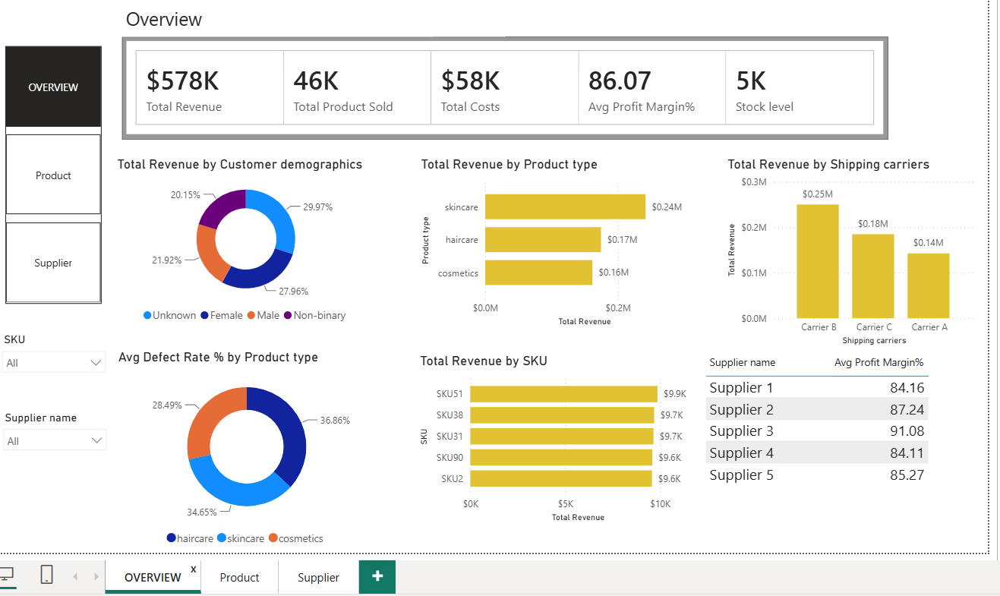
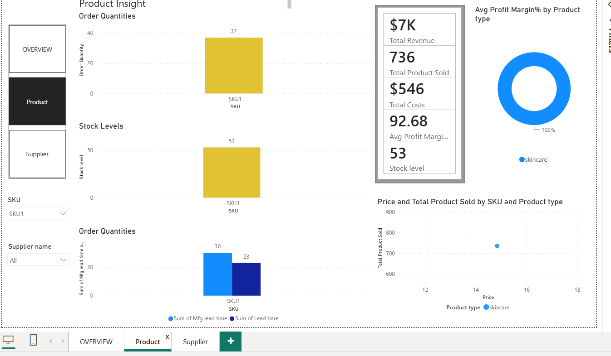
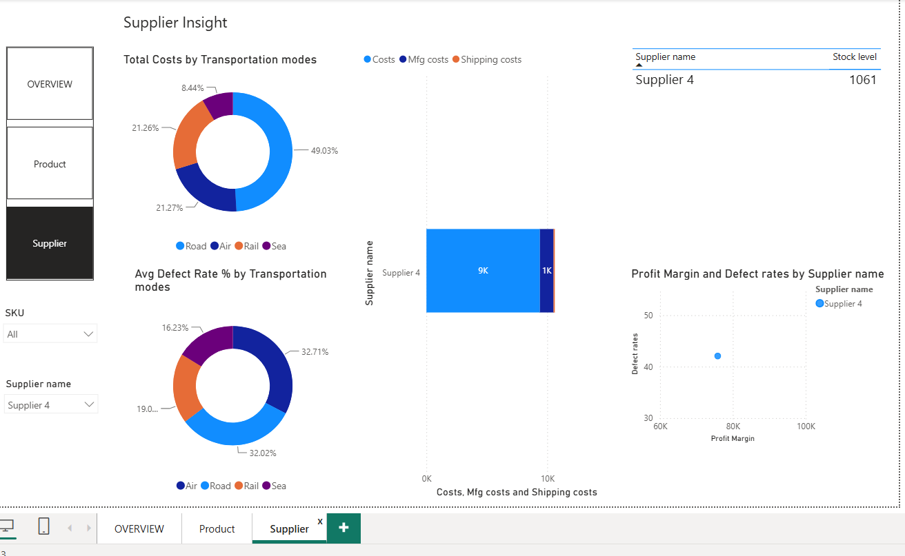

# Supply Chain Analytics Project

## Introduction
This project focuses on analyzing supply chain data using Power BI to improve operational efficiency, inventory management, and business decision-making.

## Objectives
- Analyze inventory and stock levels
- Monitor supplier performance
- Evaluate shipping costs and delivery times
- Generate actionable business insights

## Workflow
Data Collection → Data Cleaning → Data Analysis → Data Visualization → Business Insights

## Features
- Inventory Analysis
- Revenue Analysis
- Supplier Performance Tracking
- Shipping Cost Analysis
- Interactive Power BI Dashboard

## Advantages
- Improves operational efficiency
- Supports data-driven decisions
- Reduces supply chain costs
- Enhances inventory management

## Tools Used
- Power BI
- Excel/CSV

## Dashboard Screenshots

### Dashboard 1

### Dashboard 2

### Dashboard 3

## Author
Meghana
